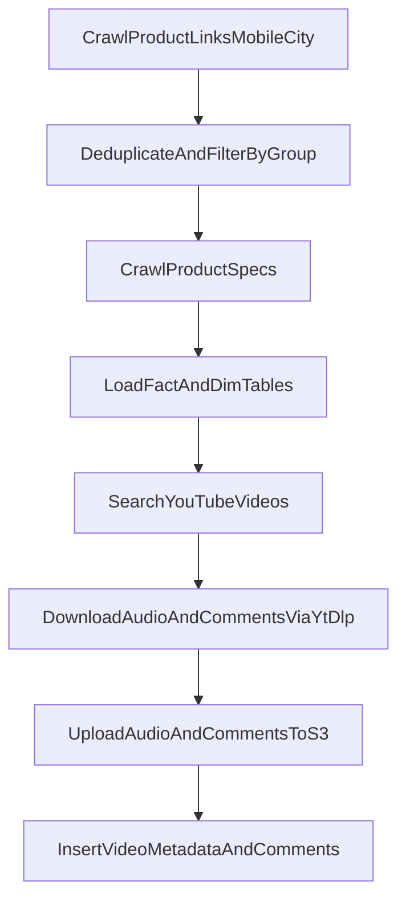

# Pipeline crawl -> DB -> YouTube media -> S3

## 1) Bối cảnh và mục tiêu

Pipeline này chuẩn hóa luồng dữ liệu sản phẩm smartphone từ nguồn MobileCity, đi qua các bước crawl + chuẩn hóa dữ liệu kỹ thuật + nạp kho dữ liệu PostgreSQL, sau đó mở rộng sang nhánh media YouTube (audio + comments), upload asset lên S3 và lưu metadata/comments vào DB.

- **Đầu vào gốc**: trang danh mục/sản phẩm MobileCity và YouTube Data API.
- **Đầu ra cuối**:
  - Dữ liệu cấu hình sản phẩm trong `fact_product` + 8 bảng dimension.
  - Metadata video + comments trong `dim_video_transcripts` và `dim_video_comments`.
  - File audio/comment ở S3 dạng `s3://<bucket>/<prefix>/<product_id>/<storage_id>_*`.

## 2) Nguồn code chính (source of truth)

- `DS200_Big_Data/backend/src/scripts/run_crawl_to_db.py`
- `DS200_Big_Data/backend/src/scripts/load_products_to_db.py`
- `DS200_Big_Data/backend/src/scripts/run_unique_smartphone_media_flow.py`
- `DS200_Big_Data/backend/src/app/services/crawlers/product_link_crawler.py`
- `DS200_Big_Data/backend/src/app/services/crawlers/product_spec_crawler.py`
- `DS200_Big_Data/backend/src/app/services/youtube_media_pipeline.py`
- `DS200_Big_Data/backend/src/app/services/s3_storage.py`

## 3) Sơ đồ tổng quan pipeline



## 4) Luồng theo stage (mục tiêu, tech stack, input/output, rủi ro)

### Stage 1 - Crawl danh sách link sản phẩm

- **Mục tiêu nghiệp vụ**: lấy danh sách sản phẩm điện thoại từ MobileCity theo slug/category.
- **Code chính**: `product_link_crawler.py` (`crawl_product_links`).
- **Tech stack**: `requests.Session`, `BeautifulSoup`, regex, cơ chế retry API page.
- **Input**: endpoint MobileCity (`/dien-thoai`, `/product_view_more`), cấu hình `settings` (cookie/csrf/max pages).
- **Output**:
  - Trong bộ nhớ: list record `{product_name, url, price_vnd, price_str, image, slug}`.
  - Khi chạy orchestration crawl-to-db: lưu `data/raw/product_links.json`.
- **Rủi ro/fail phổ biến + xử lý hiện có**:
  - Lỗi request/non-JSON response: retry theo `MAX_API_RETRIES`, log cảnh báo.
  - Duplicate URL: loại bằng `seen_urls`.
  - Crawl quá sâu: chặn bằng `mobilecity_max_pages_per_slug`.

### Stage 2 - Lọc và chuẩn hóa tập link/spec theo nhóm máy

- **Mục tiêu nghiệp vụ**: loại trùng và tách nhóm `NEW/OLD/ALL` để giảm dữ liệu nhiễu.
- **Code chính**: `run_crawl_to_db.py` (`deduplicate_link_records`, `filter_link_records`) và hàm `classify_phone`.
- **Tech stack**: regex rule-based classification.
- **Input**: `product_links.json` hoặc kết quả crawl trực tiếp.
- **Output**:
  - `data/processed/product_links_filtered_<group>.json`.
  - Về sau cùng logic này áp dụng khi lọc spec record.
- **Rủi ro/fail + xử lý**:
  - Nhận diện sai do rule text: đã có fallback mặc định về `OLD`; nên review định kỳ rule regex.

### Stage 3 - Crawl thông số kỹ thuật (spec) và map schema DB-ready

- **Mục tiêu nghiệp vụ**: lấy bảng thông số từ trang chi tiết sản phẩm và map về cấu trúc fact/dim.
- **Code chính**: `product_spec_crawler.py` (`crawl_product_specs`, `_map_to_database_schema`).
- **Tech stack**: `requests`, `BeautifulSoup`, mapping dict theo field tiếng Việt -> cột DB.
- **Input**: danh sách link đã lọc.
- **Output**:
  - Record chuẩn hóa gồm:
    - `fact_product`
    - `dim_display`, `dim_camera`, `dim_performance`, `dim_storage`,
    - `dim_design`, `dim_battery`, `dim_connectivity`, `dim_utilities`
    - `_source_url`.
  - File `data/processed/product_specs.json` và `product_specs_filtered_<group>.json` (khi chạy `run_crawl_to_db.py`).
- **Rủi ro/fail + xử lý**:
  - Trang không có bảng spec hoặc request fail: skip + log warn.
  - Link thiếu URL: skip có thống kê.
  - Tốc độ crawl: đã throttle bằng `sleep(0.8)`.

### Stage 4 - Nạp dữ liệu fact + dimension vào PostgreSQL

- **Mục tiêu nghiệp vụ**: đưa dữ liệu sản phẩm đã chuẩn hóa vào mô hình fact/dim.
- **Code chính**: `load_products_to_db.py` (`load_products_to_db`, `_insert_products`).
- **Tech stack**: SQLAlchemy Core, transaction theo từng bản ghi (`engine.begin()`), PostgreSQL `TRUNCATE ... RESTART IDENTITY`.
- **Input**:
  - Spec records (`product_specs.json` hoặc stream batch từ crawler).
  - Raw links để bổ sung `price` và `picture_url` vào `fact_product`.
- **Output**:
  - `fact_product` + 8 bảng dim sản phẩm.
  - Chỉ số `inserted`, `skipped_malformed`, `skipped_existing`.
- **Rủi ro/fail + xử lý**:
  - Duplicate `product_name`: skip trong `_insert_products` (không chèn trùng).
  - Record malformed: skip + tăng counter.
  - Nhu cầu reset dữ liệu:
    - `--truncate`: xóa YouTube tables + toàn bộ fact/dim sản phẩm.
    - `--truncate-youtube`: chỉ xóa `dim_video_comments`, `dim_video_transcripts`.

### Stage 5 - Tìm video YouTube theo sản phẩm

- **Mục tiêu nghiệp vụ**: lấy danh sách video review liên quan từng sản phẩm.
- **Code chính**: `youtube_media_pipeline.py` (`search_youtube_videos`) và orchestration ở `run_unique_smartphone_media_flow.py`.
- **Tech stack**: YouTube Data API v3 (`search.list`), `requests`.
- **Input**: `product_name` từ `fact_product`, API key từ env.
- **Output**: list `{youtube_url, video_title}` cho mỗi sản phẩm.
- **Rủi ro/fail + xử lý**:
  - Quota/rate limit 403: raise `YouTubeQuotaExceededError`, lưu checkpoint để resume.
  - API key thiếu: fail fast với `ValueError`.
  - Query quá dài: đã log preview cắt ngắn.

### Stage 6 - Tải audio và comments bằng yt-dlp

- **Mục tiêu nghiệp vụ**: trích xuất audio (.mp3) và comments từ từng video.
- **Code chính**: `youtube_media_pipeline.py` (`download_audio`, `download_comments`).
- **Tech stack**: `yt-dlp`, subprocess, JSON parse, CSV writer.
- **Input**: `youtube_url`, `output_stem`.
- **Output local** (mặc định): trong `data/processed/youtube_media/`
  - `<stem>.mp3`
  - `<stem>.info.json`
  - `<stem>_comments.csv`
- **Rủi ro/fail + xử lý**:
  - Thiếu `yt-dlp`: fail rõ thông báo.
  - Thiếu JS runtime cho yt-dlp extractor: tự dò `node`/`deno`, log cảnh báo nếu không có.
  - Lỗi từng video: catch, skip video, tiếp tục pipeline.

### Stage 7 - Upload media/comments lên S3

- **Mục tiêu nghiệp vụ**: lưu trữ asset ngoài DB để tối ưu lưu trữ và truy xuất.
- **Code chính**: `s3_storage.py` (`upload_audio_file`, `upload_comments_file`).
- **Tech stack**: `boto3` S3 client.
- **Input**: file local đã tải ở Stage 6, `product_id`, `storage_id` (YouTube video id).
- **Output**:
  - URL dạng `s3://<bucket>/<key_audio>`
  - URL dạng `s3://<bucket>/<key_comments>`
- **Rủi ro/fail + xử lý**:
  - Thiếu bucket/credential: fail sớm qua validate env.
  - Upload lỗi mạng/phân quyền: catch ở orchestration và skip video.

### Stage 8 - Ghi metadata video/comments vào DB và hoàn tất

- **Mục tiêu nghiệp vụ**: liên kết sản phẩm với video + comments để phục vụ truy vấn phân tích.
- **Code chính**: `run_unique_smartphone_media_flow.py`
  - `insert_video_metadata`
  - `insert_video_comments`
  - checkpoint helpers `_read_checkpoint`, `_write_checkpoint`.
- **Tech stack**: SQLAlchemy Core + transaction.
- **Input**:
  - `product_id`, `youtube_url`, `s3_audio_path`, `s3_comments_path`, danh sách comments.
- **Output**:
  - `dim_video_transcripts` (1 row/video, có đường dẫn S3)
  - `dim_video_comments` (N row/video)
  - checkpoint file (khi cần resume): `data/processed/youtube_media_checkpoint.json`.
- **Rủi ro/fail + xử lý**:
  - URL video đã tồn tại: trả `existing_video_id`, tránh duplicate metadata.
  - Hết quota giữa chừng: persist checkpoint `last_completed_index`, hỗ trợ `--resume`.
  - Product đã đủ số video mục tiêu: mặc định skip để tiết kiệm quota (`--force-all-products` để override).

## 5) Bảng mapping dữ liệu giữa các tầng

| Tầng dữ liệu | Nguồn -> Đích | Định dạng/Lưu trữ | Ghi chú |
|---|---|---|---|
| Link crawl | MobileCity -> `product_links.json` | JSON (`data/raw`) | Gồm tên, URL, giá, ảnh |
| Link lọc | `product_links.json` -> `product_links_filtered_<group>.json` | JSON (`data/processed`) | Deduplicate + filter NEW/OLD/ALL |
| Spec crawl | Product URL -> `product_specs.json` | JSON (`data/processed`) | Gồm `fact_product` + 8 dim payload |
| Load warehouse | `product_specs*.json` + raw links -> `fact_product` + 8 dim bảng | PostgreSQL | Bổ sung giá/ảnh từ link index |
| Media metadata | Product trong DB -> kết quả YouTube search | In-memory + local files | Lấy N video review mỗi sản phẩm |
| Media files | Local audio/comments -> `s3://...` | Amazon S3 | Key theo prefix/product_id/storage_id |
| Media warehouse | YouTube + S3 path -> `dim_video_transcripts`/`dim_video_comments` | PostgreSQL | Lưu URL video + path S3 + comment text |

## 6) Luồng vận hành điển hình và command mẫu

> Chạy trong thư mục `DS200_Big_Data/backend`.

### 6.1 Crawl + stream vào DB (không media)

```bash
python -m src.scripts.run_crawl_to_db --target-group NEW --db-batch-size 5
```

- Dùng khi cần làm mới dữ liệu sản phẩm từ nguồn crawl.
- Thêm `--skip-link-crawl` nếu muốn tái sử dụng `--links-file` hiện có.

### 6.2 Chạy full pipeline đến YouTube + S3

```bash
python -m src.scripts.run_unique_smartphone_media_flow \
  --specs data/processed/product_specs.json \
  --links data/raw/product_links.json \
  --target-group NEW \
  --max-products 50
```

### 6.3 Khi nào dùng `--truncate`

- Dùng khi cần **reset toàn bộ** dữ liệu trước khi nạp lại từ JSON.
- Áp dụng cho:
  - `run_crawl_to_db.py --truncate`
  - `run_unique_smartphone_media_flow.py --truncate`

### 6.4 Khi nào dùng `--truncate-youtube`

- Dùng khi muốn **xóa nhánh YouTube/media** để ingest lại media, nhưng giữ nguyên fact/dim sản phẩm.
- Hữu ích khi thay đổi logic tải comments/audio hoặc đổi naming key S3.

### 6.5 Khi nào dùng `--resume`

- Dùng khi pipeline media dừng giữa chừng (thường do quota YouTube).
- Script đọc checkpoint file, bỏ qua sản phẩm đã hoàn tất trước đó.

```bash
python -m src.scripts.run_unique_smartphone_media_flow --resume
```

### 6.6 Khi nào dùng `--force-all-products`

- Mặc định script sẽ skip sản phẩm đã đủ số video trong DB để tiết kiệm quota.
- Dùng `--force-all-products` khi cần crawl lại media cho toàn bộ sản phẩm, kể cả sản phẩm đã đủ video.

## 7) Mở rộng đề xuất cho nhánh audio/comment lên S3

- Chuẩn hóa naming key theo version:
  - `audio/v1/<product_id>/<video_id>_audio.mp3`
  - `comments/v1/<product_id>/<video_id>_comments.csv`
- Thêm metadata object S3 (content-type, source-url, ingested-at) để dễ quản trị lifecycle và truy vết.
- Thiết lập quan sát quota/cost:
  - cảnh báo khi tỷ lệ `quota exceeded` tăng,
  - theo dõi số file upload/ngày và dung lượng tăng trưởng bucket.
- Thêm retry có backoff cho upload S3 và ghi nhận dead-letter list cho video lỗi nhiều lần.
- Bổ sung dashboard vận hành:
  - số sản phẩm hoàn tất,
  - số video thành công/thất bại,
  - số comments đã ghi vào DB.
